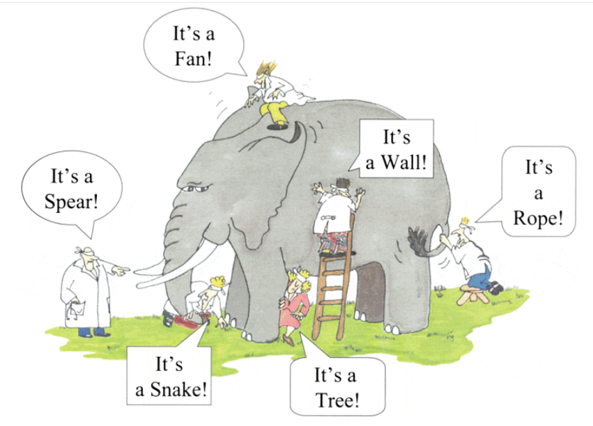
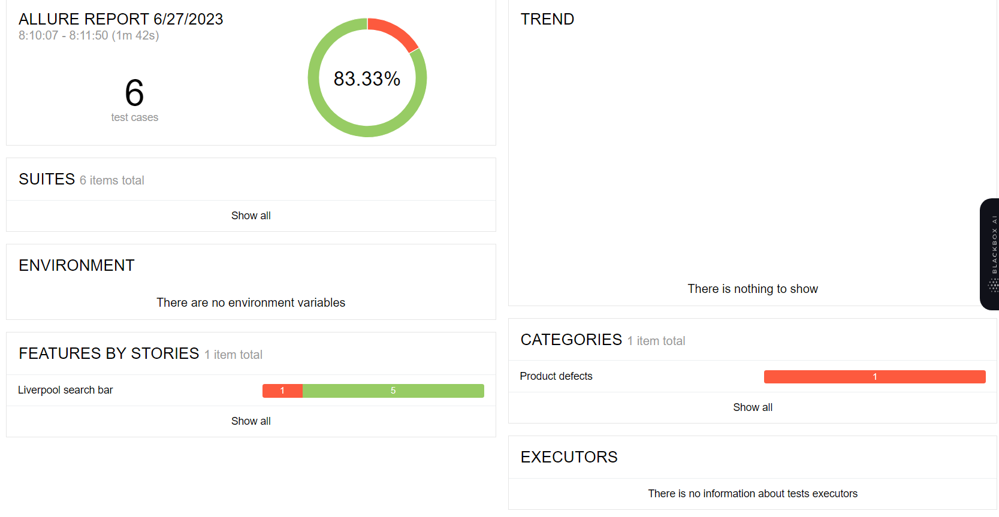
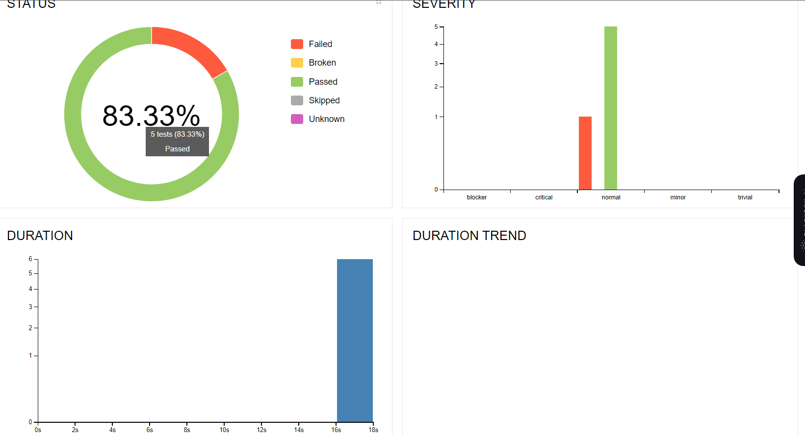
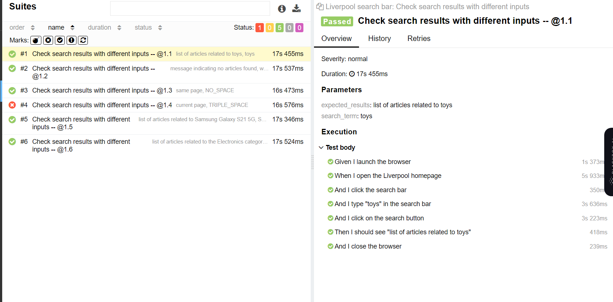

# Liverpool QA Automation Exercise

## Behavior Driven Development

Behavior Driven testing is an extension of TDD. Like in TDD in BDD also we write tests first and the add application code. The major difference that we get to see here are:

* Tests are written in plain descriptive English type grammar.
* Tests are explained as behavior of application and are more user-focused.
* Using examples to clarify requirements.

This difference brings in the need to have a language that can define, in an understandable format.

## What is Cucumber?

***Cucumber*** is a testing framework which supports ***Behavior Driven Development* (BDD).** It lets us define application behavior in plain meaningful English text using a simple gramar defined by a language called ***Gherkin.***

## Why BDD Framework?

Most software projects involve teams of several people working collaboratively together, so high-quality communication is critical to their success. As you probably know, good communication isn’t just about eloquently describing your ideas to others; you also need to solicit feedback to ensure you’ve been understood correctly. This is why agile software teams have learned to work in small increments, using the software that’s built incrementally as the feedback that says to the stakeholders “***Is this what you mean?***

### *Wrong Perception*

With the help of Gherkin language cucumber helps facilitate the discovery and use of a ubiquitous language within the team. Cucumber test removes many misunderstandings long before they create any ambiguities in to the code.

### Selenium vs Cucumber

* Selenium is a testing framework, whereas Cucumber is a behavior driven development tool.
* The selenium process makes the testing more reliable and dependable, whereas Cucumber testing is not reliable comparatively.
* In Selenium test scripts are written based on test cases and requirements. In Cucumber scenarios are written and verified by Business Analyst before execution.
* In Selenium, syntax errors are easy to find while developing. In Cucumber syntax errors are not getting into notice while writing.
* Plugins in Selenium works slower as compared to Cucumber.

## About the exercise

During this exercise, I just decided to automate the search bar funcionality. I've skipped the Story 3. "Create a consumer account", due to is necessary to have an authentication code.
Also, I have generated some evidences utilizing the Allure module, generating a comprehensive and visually appealing final report that showcases the state and outcomes of the project. This final report provides a clear and organized overview of the progress made and achievements attained.

The Allure-generated final report showcases the tests performed, including both successful and failed ones. For successful tests, it provides detailed information about the inputs used, the executed steps, and the obtained results. This offers a clear understanding of the project functionalities that have been correctly implemented.

The final report also incorporates charts and metrics, presenting visual information about the overall project status and test performance. These visual elements allow for a quick grasp of the project's quality, progress, and help identify areas that require additional attention.

Furthermore, for the failed tests, the final report with Allure provides a comprehensive view of the encountered errors and issues. It displays logs, error messages, and other relevant information that facilitate the identification and resolution of problems.

Overall, the Allure-generated final report serves as a valuable tool for effectively communicating the project results and presenting tangible evidence of its current state. It offers a comprehensive and lucid view of the progress made, test outcomes, and encountered issues, enabling informed decision-making and effective collaboration with other team members.

## What Best Practices did i follow?

1. Creating a virtual environment is indeed a recommended practice when working with Cucumber and Selenium. It helps to isolate your project dependencies and ensures that your project's packages and versions do not conflict with other Python projects on your system.
2. Organize your project into logical directories and packages to separate different concerns such as feature files, step, definitions, configuration files, etc...
3. Implement step definitions that map to the steps in your feature files. Keep the step definitions clean and concise, delegating the actual test logic to page objects or utility classses.
4. Integrate a reporting framework, such as Allure, to generate comprehensive test reports.
5. Using selectors in web automation with tools like Selenium is considered a good practice because it separates element identification logic from test logic, promotes code reusability and maintainability, improves code readability and understandability, handles dynamic elements, and supports different locator strategies. By using selectors, you can write cleaner and more maintainable automation code that is robust and adaptable to changes in the web application.

## How is my Code structured?

1. The necessary modules and packages are imported, including `behave`, `webdriver` from Selenium, and `By` from Selenium WebDriver.
2. Step definitions: Each step (Given, When, Then) is defined as a function using the appropriate decorator (`@given`, `@when`, `@then`). These functions represent the business steps that will be executed during scenario execution.
3. Step implementation: Inside each step function, I write the code to perform the corresponding action, such as opening the browser, navigating to a webpage, interacting with elements, etc. The `context.driver` object is used to interact with the browser and perform the necessary actions.
4. Parameters and variables: Steps that require dynamic data, such as search terms, are defined with parameters enclosed in curly braces, like `{search_term}`. These parameters are passed to the corresponding step functions.
5. Verification of results: In the `verify_search_results` function, I implement the logic to verify the expected search results. I use if-elif conditions to perform different verifications based on the `expected_results` value. XPath expressions are used to find relevant elements on the page, and assertions are made to check if the elements are present and meet the expected conditions.
6. Closing the browser: The `closeBrowser` function closes the browser using the `close()` method of the `context.driver` object.

## Explaining Selectors

The code uses selectors to identify and locate specific elements on the web page. The `By.ID` selector is used to find elements by their `id` attribute, which provides a unique identifier for each element. This approach is preferred when the element has a specific and stable `id` value. On the other hand, the `By.XPATH` selector is used to locate elements based on their position and attributes using an XPath expression. While XPath can be more verbose, it allows for more flexible and complex element identification. In this code, XPath is used to locate elements based on their structure and hierarchy in the HTML document. However, it's generally recommended to prioritize using more concise and specific selectors like `By.ID` when possible to improve code readability and maintainability.

## How could be better?

Consuming APIs can significantly simplify and enhance this project. By leveraging APIs, we can access and utilize pre-built functionalities and data from external services, reducing the need for extensive code implementation.

We can dentify common elements and repetitive functionalities in our tests and encapsulate them into reusable functions. This reduces code duplicaton and makes test updates easier in case of changes.

Ensure proper handling of errors and exceptions in our tests. Use control structures like try-catch to capture and manage errors effectively, providing clear and helpful error messages for easier debugging.

## Why Selenium with Cucumber is a good tool? Advantages / Disadvantages

### Advantages

1. The benefit of using Cucumber with Selenium is that the test cases are written in simple feature files which are easily understood by managers, non-technichal stakehodlers and business analysts. In other words, Cucumber allows you to write test scenerios in a human-readable format using the Gherkin syntax.
2. Cross-Browser Compatibility: Selenium WebDriver supports multiple web browsers and versions. This helps ensure the compatibility and consistent behavior of our application across various browser enviroments.
3. With Selenium and Cucumber, we can execute tests in a controlled and automated manner. Cucumber provides test runners that can execute feature files and generate detailed reports, including test results and statistics. This enables efficient test execution, result analysys, and identification of issues.
4. There are many documentations by the community, so it is easy understandable.
5. By combining the power of Selenium and the structures approach of Cucumber, we can create maintainable, readable, and collaborative automated tests that verify the behavior of our web applications effectively.

### Disadvantages

1. Learning Curve: Selenium and Cucumber require a certain level of technical proficiency to set up and use effectively. Learning the frameworks, understanding their concepts, and writing tests using the Gherkin syntax may require some initial investment of time and effort.
2. Setup and Configuration: Configuring Selenium WebDriver and setting up the test environment can be complex, especially when dealing with different browsers and operating systems. Managing dependencies, drivers, and ensuring compatibility across different versions can sometimes be challenging.
3. Test Execution Speed: Selenium tests can be relatively slow compared to unit tests or API tests since they involve interacting with the actual browser. This can impact the overall execution time, especially when dealing with a large number of test cases.
4. Fragile Tests: Selenium tests are sensitive to changes in the application's UI, such as CSS class names, element locations, or dynamic IDs. Even small UI changes can break the test scripts, requiring frequent updates to the tests.

# References

* Cucumber. (2019). Behavior-Driven Development. [https://cucumber.io/docs/bdd/](https://cucumber.io/docs/bdd/)
* Quora. (2023). Which is the best Selenium automation framework, POM or Cucumber. [https://www.quora.com/Which-is-the-best-Selenium-automation-framework-POM-or-Cucumber](https://www.quora.com/Which-is-the-best-Selenium-automation-framework-POM-or-Cucumber)
* Sharma, L. (2021). Behavior Driven Development. [https://www.toolsqa.com/cucumber/behavior-driven-development/](https://www.toolsqa.com/cucumber/behavior-driven-development/)
